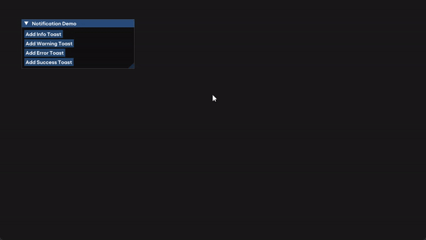

# ImGui Toasts Demo



This repository contains some simple taosts that can be used with [Dear ImGui](https://github.com/ocornut/imgui) library.

## Getting Started

### Prerequisites

- C++ compiler (e.g., g++, clang++)
- CMake
- GLFW
- OpenGL

### Building the Project

1. Clone the repository:

    ```sh
    git clone https://github.com/yourusername/imgui-toasts-demo.git
    cd imgui-toasts-demo
    ```

2. Create a build directory and navigate to it:

    ```sh
    mkdir build
    cd build
    ```

3. Run CMake to configure the project:

    ```sh
    cmake ..
    ```

4. Build the project:

    ```sh
    cmake --build .
    ```

### Running the Application

After building the project, you can run the application from the build directory:

```sh
./imgui-toasts-demo
